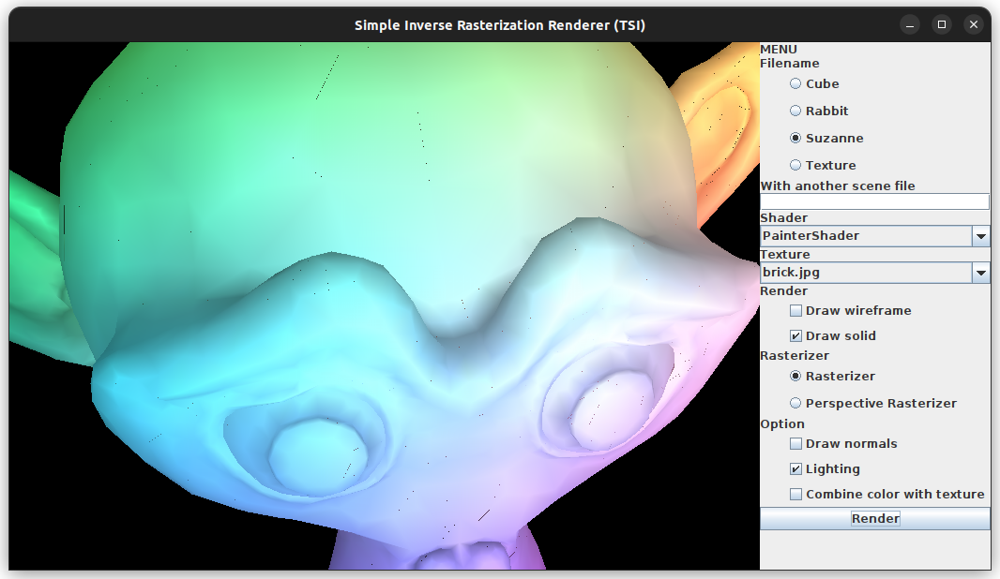
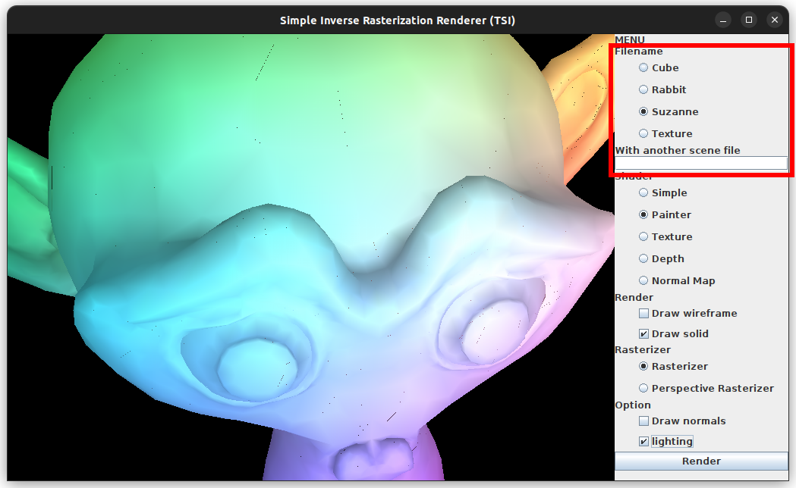
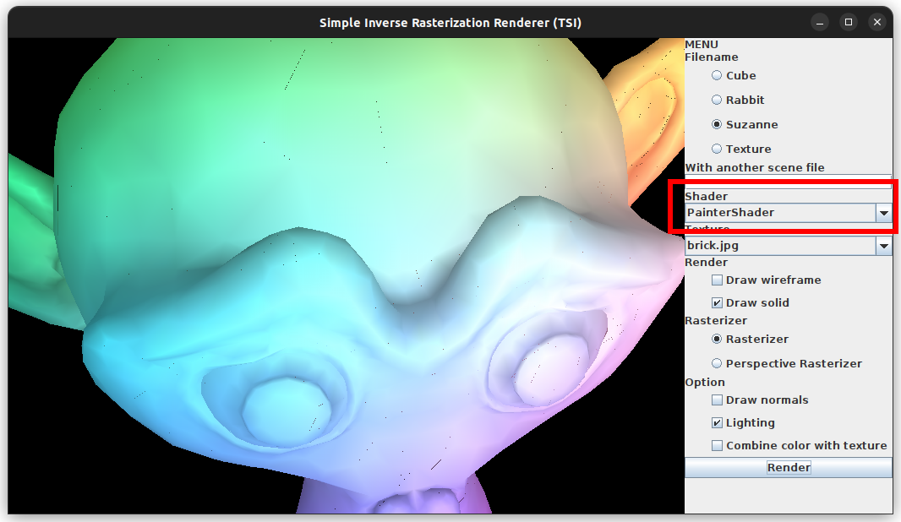
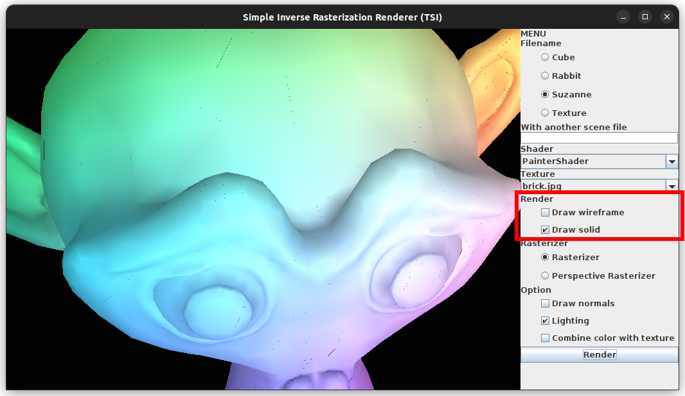
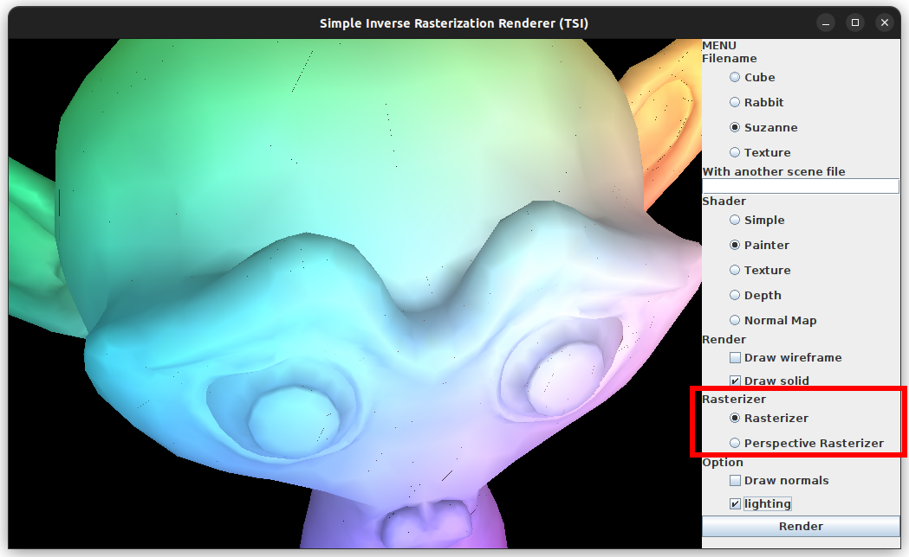
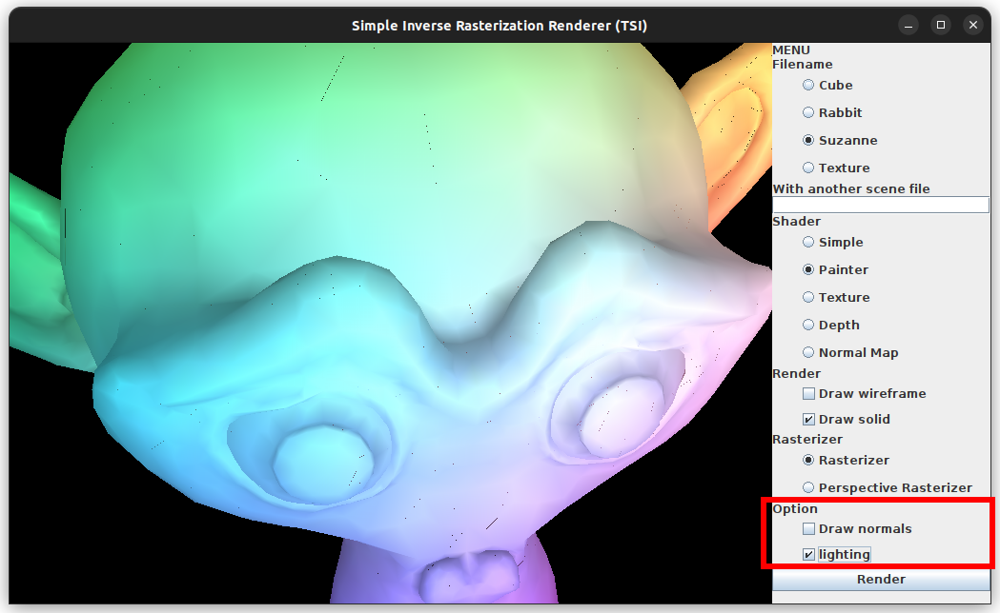

# A "Do it yourself" renderer

This is a simple rendering engine made in Java.



## The GUI

The GUI provides tools to render the scene.

### Model

You can choose the model to render in the filname part of the menu. If you have
another `file.scene` which you want to render using this App, you can also copy
the file in the `data/` dir and write his basename in the Text Field "With
another scene file".



### Shader

You can choose differents shader to render the model in the shader menu.



### Render

You can choose what you want the GUI to render in the render menu.



### Rasterizer

You can choose what rasterizer you want the GUI to use in the Rasterizer menu.



### Options

You can enable and disable options such as light and drawn of normals in the
option menu.



### Render Button

It will update the view panel.

## MakeFile

### Build

Use the following command to build the project:

```bash
make
```

### Clean

it compiles all the sources and places them in the `build` folder.

```bash
make clean
```

cleans the `build` folder.

### Tests

To run the tests use the following command:

```bash
make tests
```

### Run

To run the project you can use the following command:

```bash
make run
```

## Ant

### Version to use

#### Java 17 and below

You can compile the project using Ant version 1.10.7 (already on ENSEEIHT's
computer).

#### All Java

You can compile the project using Ant version 1.10.14 and later
([download here](https://dlcdn.apache.org//ant/binaries/apache-ant-1.10.15-bin.tar.gz)).

You can also install ant package as any other package by the command on your
personal computer:

```bash
sudo snap install ant --stable --classic
```

### Show help in terminal

To a small description of the available task in ant, do:
```bash
ant -projecthelp
```

### Build

Use the following command to build the project:

```bash
ant
```

or

```bash
ant compile
```

### Run

To run the project you can use the following command:

```bash
ant run
```

### Generate ClassDiagram

To generate the [PlantUML](https://plantuml.com/class-diagram) file only do :

```bash
ant createUML
```

To generate the [PlantUML](https://plantuml.com/class-diagram) file and get the png of it :

```bash
export PLANTUML_LIMIT_SIZE=8192
ant create-plantUML
```

The class diagram can be a little big, to hide fields you can add :
```
hide fields
```
in the `doc/uml/Class Diagram.puml` file.

To hide methods you can add :
```
hide methods
```

to hide both, you can add :
```
hide members
```

and then you can run :
```sh
ant plantUML
```


### Generate JavaDoc

To genrate JavaDoc of the project do:

```bash
ant doc
```

To clean JavaDoc

```bash
ant clean-doc
```

### Build Tests

```bash
ant compile-test
```

### Clean

it compiles all the sources and places them in the `bin/cls` folder.

```bash
ant clean
```

cleans the `bin` folder.

### Tests

To run all tests use the following command:

```bash
ant test
```

The test reports will be written in the dir `test/reports/`.

To run fonctionnal Tests:

```bash
ant func-tests
```

To run unit Tests:

```bash
ant unit-tests
```

### verify the CheckStyle

To verify checkstyle on the project if you have checkstyle in lib:

```bash
ant checkstyle
```

To download the lib:

```bash
ant dl-checkstyle
```

### Make a jar

To make a jar of the project do:

```bash
ant jar
```
