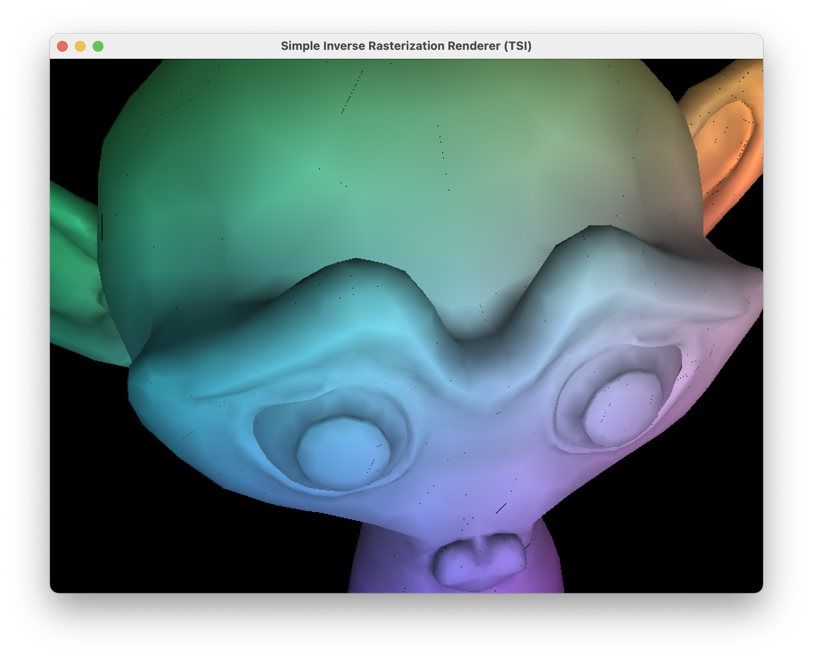

# A "Do it yourself" renderer

This is a simple rendering engine made in Java.



## MakeFile

### Build

Use the following command to build the project:

```bash
make
```

### Clean

it compiles all the sources and places them in the `build` folder.

```bash
make clean
```

cleans the `build` folder.

### Tests


To run the tests use the following command:

```bash
make tests
```

### Run

To run the project you can use the following command:

```bash
make run SCENE=path/to/file.scene
```

where `path/to/file.scene` is the path to the scene file, e.g. `data/example0.scene`.


## Ant

### Version to use

#### Java 17 and below

You can compile the project using Ant version 1.10.7 (already on ENSEEIHT's computer).


#### All Java

You can compile the project using Ant version 1.10.14 and later ([download here](https://dlcdn.apache.org//ant/binaries/apache-ant-1.10.15-bin.tar.gz)).

You can also install ant package as any other package by the command on your personal computer:

```bash
sudo snap install ant --stable --classic
```

### Build

Use the following command to build the project:

```bash
ant
```

or

```bash
ant compile
```

### Build Tests

```bash
ant compile-test
```
It compiles all the sources and places them in the `bin/cls` folder.

### Clean


```bash
ant clean
```

cleans the repository.

```bash
ant clean-doc
```

cleans the javadoc generated.

```bash
ant clean-test
```
cleans the reports directory.

### Tests

To run all tests use the following command:

```bash
ant test
```
The test reports will be written in the dir ```test/reports/```.

To run fonctionnal Tests:

```bash
ant func-tests
```

To run unit Tests;

```bash
ant unit-tests
```

### Run

#### Generic

To run the project you can use the following command:

```bash
ant run -DSCENE=path/to/file.scene
```

where `path/to/file.scene` is the path to the scene file, e.g. `data/example0.scene`.

#### Run cube

To run the script with the cube scene run :
```bash
ant cube
```

#### Run rabbit

To run the script with the rabbit scene run :
```bash
ant rabbit
```


#### Run Suzanne (the Monkey)

To run the script with the rabbit scene run :
```bash
ant run
```


### Generate JavaDoc

To genrate JavaDoc of the project do:

```bash
ant doc
```

To clean JavaDoc

```bash
ant clean-doc
```


### verify the CheckStyle

To verify checkstyle on the project if you have checkstyle in lib:

```bash
ant checkstyle
```

To download it:

```bash
ant dl-checkstyle
```

### Make a jar

To make a jar of the project do:

```bash
ant jar
```
